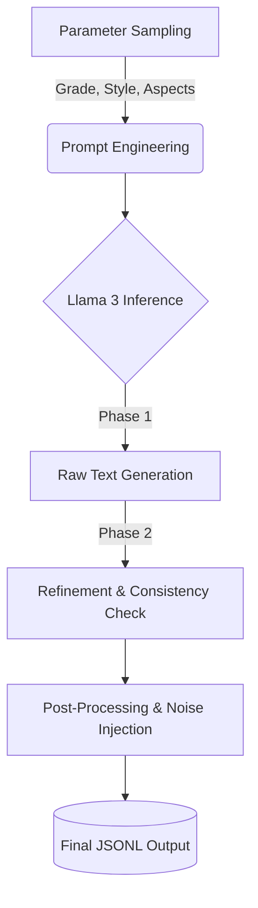

# 🎓 Synthetic ABSA: Student Reviews Dataset Generator


> **A robust data generation pipeline leveraging local LLMs (Llama 3 via Ollama) to create high-quality, labeled synthetic datasets for Aspect-Based Sentiment Analysis (ABSA).**

---

## 🚀 Overview
Collecting labeled data for fine-grained sentiment analysis is expensive and time-consuming. This project automates the creation of a **nuanced educational dataset** containing 6,000+ student course reviews.

Unlike simple sentiment analysis (positive/negative), this engine generates **aspect-level labels** (e.g., specific sentiment towards *Exam Fairness* vs. *Lecturer Quality* in the same review) and mimics diverse writing styles using a **two-pass generation approach**.

### ⚡ Quick Look
**Why is this better than standard data?**
* **Standard Sentiment:** "The course was bad." ❌ *(Too simple)*
* **Synthetic ABSA (Ours):** "The **lecturer** was great `[Positive]`, but the **exams** were unfair `[Negative]`." ✅ *(Nuanced & Label-Rich)*

### Key Features
*  **Zero-Cost Inference:** Runs 100% locally on **Llama 3** via **Ollama** (No API costs).
*  **Two-Pass Refinement:** A sophisticated pipeline that generates a base draft and then refines it to strictly match label constraints and style guidelines.
*  **Dynamic Personas:** Simulates 6 distinct writing styles (e.g., *"Casual Texting"*, *"Analytic"*, *"Rant"*) to ensure model robustness against real-world noise.
*  **Noise Injection:** Automatically introduces typos, slang, and structural noise to prevent "synthetic artifacts" and overfitting.
*  **Balanced Sampling:** Implements weighted sampling algorithms to ensure class balance across grades (A-F) and sentiment polarities.

---

## 🛠️ Tech Stack
* **Core:** Python
* **LLM Backend:** Ollama (Llama 3), extensible to OpenAI GPT-4o.
* **Data Handling:** JSONL format for streaming efficiency.
* **Architecture:** Modular design with `RobustDataGenerator` class handling sampling, prompting, and post-processing.

---

## 📊 Dataset Structure
The output is a `.jsonl` file ideal for training custom NLP models.

**Sample Record:**
```json
{
  "course_name": "Computer Networks",
  "lecturer": "Prof. Klein",
  "grade": "D (Barely passed)",
  "style": "Confused Student",
  "aspects": {
    "workload": "neutral",
    "exam_fairness": "negative"
  },
  "review_text": "so is this course worth it? workload's okay i guess but the exam made no sense..."
}

```
---
## Supported Aspects
The dataset covers 10 distinct educational aspects, enabling granular sentiment analysis:
`difficulty`, `clarity`, `workload`, `lecturer_quality`, `exam_fairness`, `relevance`, `interest`, `support`, `materials`, `overall_experience`.

---

## ⚙️ How It Works (The Pipeline)


---
### Pipeline Steps:
1. **Parameter Sampling:** Randomly selects course metadata, student persona, and target aspects-sentiment pairs (logic-constrained).
2. **Prompt Engineering:** Constructs a dynamic prompt with `FORBIDDEN_PHRASES` to avoid robotic patterns.
3. **Generation & Refinement:**
    * *Phase 1:* Generate raw text based on constraints.
    * *Phase 2:* Refine text to ensure alignment with specific aspect labels.
4. **Post-Processing:** Cleans artifacts, injects "human" noise (abbreviations, lowercase, typos), and validates length.

---

## 💻 Getting Started

### Prerequisites
* Python 3.x
* [Ollama](https://ollama.com/) installed and running locally.

### Installation
```bash
git clone [https://github.com/HITProjects/SyntheticTextData.git](https://github.com/HITProjects/SyntheticTextData.git)
cd SyntheticTextData/edu
pip install -r requirements.txt
```
---
### Usage
1. **Start the LLM Server:**
   Make sure Ollama is serving the Llama 3 model:
   ```bash
   ollama run llama3
   ```
   ---

2. **Run the Generator:**
   You can run the provided notebook or script to generate data:
   ```bash
   # Example command
   python generate_dataset.py --count 100 --output my_data.jsonl
   ```
   ---
   ## 📈 Results
* **Total Samples:** 6,000 labeled reviews.
* **Format:** JSONL (Ready for HuggingFace `datasets` library).
* **Diversity:** High lexical diversity due to multi-style prompting and noise injection.

---

## 👤 Author
**Guy Yogev**
